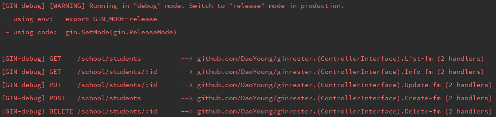

# Build api with [ginrester](https://github.com/DaoYoung/ginrester "ginrester")
This Example is about student and teacher at school.
* new student will go to school, like create a student
* you can find students who like basketball, and look for someone's information
* when someone transferred, it will be delete name at student book
* so as teachers
* Teacher has many students

## Install GinRester
`go get github.com/DaoYoung/ginrester`

## Create model
Embed `ginrester.Model` in you code, like this

```
type Student struct {
	ginrester.Model
	Name          string `json:"name"`
	Hobby         string `json:"hobby"`
	Age           int    `json:"age"`
	Sex           int    `json:"sex"`
	HeadTeacherId int    `json:"head_teacher_id"` // set up a one-to-one connection with teacher
}
```

## Create controller
Embed `ginrester.Controller`, and declare 3 func: model(), modelSlice(), Rester()
```
type StudentController struct {
	ginrester.Controller
}
//set up resource
func (action *StudentController) model() ginrester.ResourceInterface {
	return &(model.Student{})
}
//for list result
func (action *StudentController) modelSlice() interface{} {
	return &[]model.Student{}
}
//controller factory
func (action StudentController) Rester() (actionPtr *StudentController) {
	action.Init(&action)
	return  &action
}
```
## Create route
simple and easy to create restful route.
```
ginrester.CreateRoutes(school, endpoint.StudentController{}.Rester())
```
Append arguments at last, if you want personal actions.
```
ginrester.CreateRoutes(school, endpoint.StudentController{}.Rester(), "create", "list", "info")
```

## Go build main.go
* now, you can create/update/list/findOne/delete student.

* you can create before/after function for create/update/delete student.
```
func (action *StudentController) beforeCreate(c *gin.Context, m ginrester.ResourceInterface) {
	//valid data
}
func (action *StudentController) afterCreate(c *gin.Context, m ginrester.ResourceInterface) {
	//log something
}
```
* field condition in url will work, if you want filter list. <br>
e.g. List who like basketball: <http://localhost:8080/school/students?hobby=basketball>

##So as teacher.
Create model, controller, route etc at the same way

## Teacher has many students

### Create HasManyStudentController
* It's contain `StudentController`, and declare `parentController func`.
* The resource teacher connect to student by field 'head_teacher_id', so we need declare `listCondition func`

### Duplicate resource ID in route
Default key is ":id", so it will confuse to get key's value at two level resource.

Func `IsRestRoutePk` will help to create unique key
```
func (action *TeacherController) IsRestRoutePk() bool {
	return true
}
```

Now, you can get students from teacher.